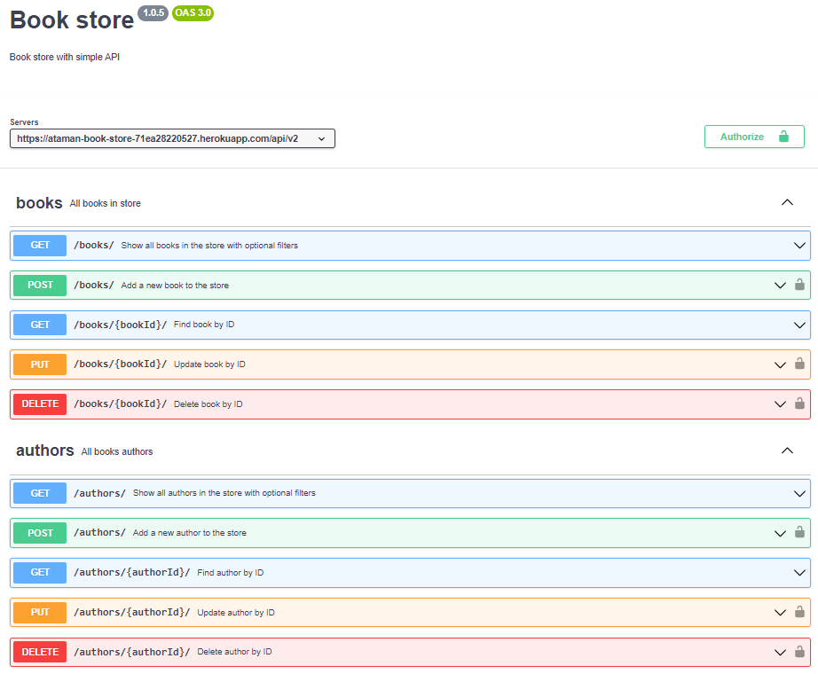
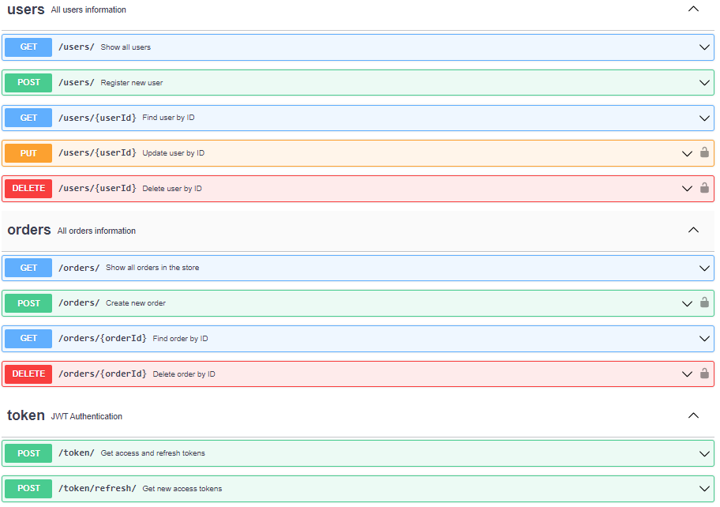

# Book store

## API для магазину книжок
#### DRF, Docker, Docker compose, Postgres, Redis, Pytest, Swagger, OpenAPI

### [Документація для API](https://app.swaggerhub.com/apis/ATAMANENKOALEX90/book-store/1.0.5) та у файлі: swagger.yaml 

### Розгортаня проекту локально (команди для Windows)

1. Склонувати репозиторій
    ```bash
    git clone https://github.com/AtamanAA/book_store.git    
    ```
2. Перейти до основної деректорії проекту 
   ```bash
    cd book_store    
    ```

3. Запустити проект у Docker (переконатися що [Docker Desktop](https://www.docker.com/products/docker-desktop/) запущений )
    ```bash
    docker compose up    
    ```
4. В браузері перейти на головну сторінку
    http://0.0.0.0:8000/ або http://localhost:8000/


### Скріни API документації


